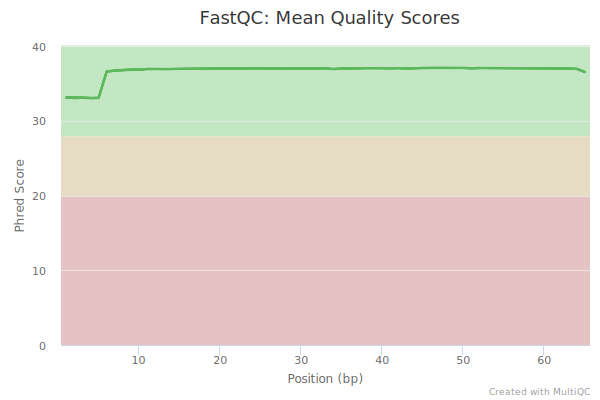
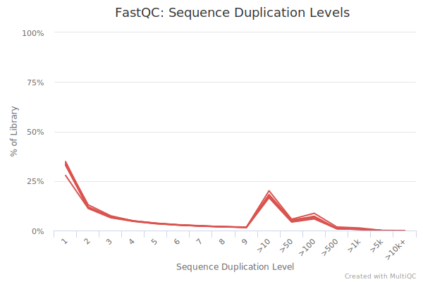

# hse21\_hw3

## Часть 1
[colab](https://colab.research.google.com/drive/1mddzp0s1ItV6JpKl0k1uPq7KTbMCz6K7?usp=sharing)

### Графики MultiQC

### Статистика

| ID         | Type         | Total reads | Aligned           | Aligned (unique)  | Gene reads |
|------------|--------------|-------------|-------------------|-------------------|------------|
| SRR3414629 | Reprogrammed | 21106089    | 20510113 (97.18%) | 18375888 (87.06%) | 16049609   |
| SRR3414630 | Reprogrammed | 15244711    | 14832680 (97.30%) | 13186139 (86.50%) | 11465324   |
| SRR3414631 | Reprogrammed | 24244069    | 23547686 (97.13%) | 20928945 (86.33%) | 18408851   |
| SRR3414635 | Control      | 20956475    | 20395865 (97.32%) | 18428317 (87.94%) | 16275997   |
| SRR3414636 | Control      | 20307147    | 19757059 (97.29%) | 17825380 (87.78%) | 15757580   |
| SRR3414637 | Control      | 20385570    | 19847291 (97.36%) | 17844858 (87.54%) | 15736978   |

## Часть 2
[colab](https://colab.research.google.com/drive/1Qrt3oWOzVvPtI_umZKVGEBEThByf-kX-?usp=sharing)

